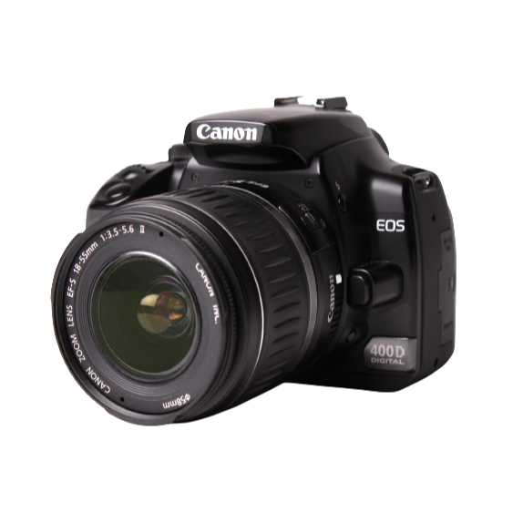
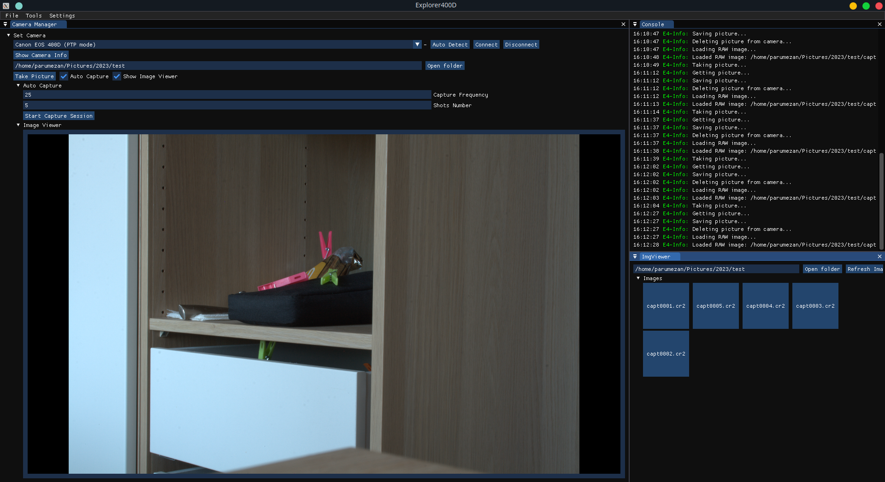
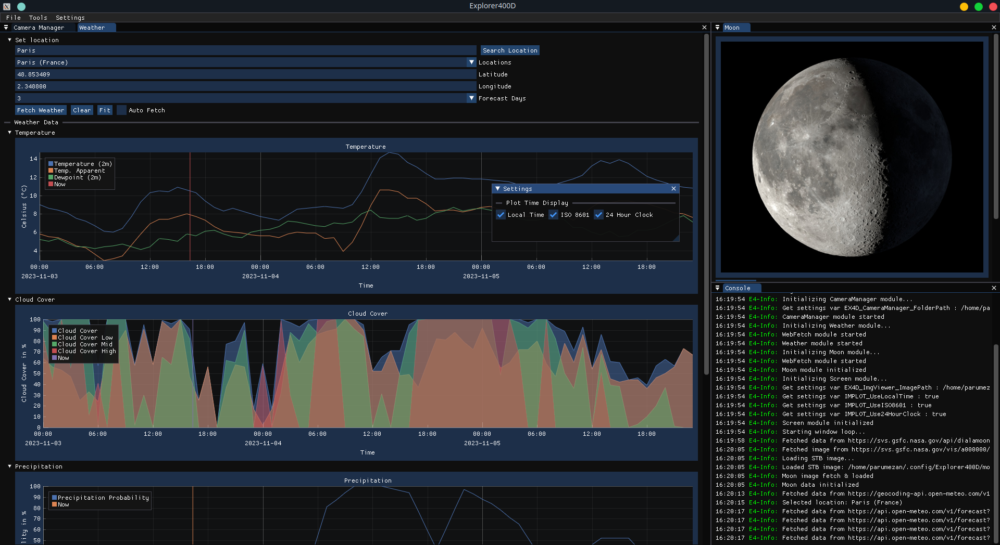

# 
A tool for night photography

<!-- Status Time -->

 
 
 
 

Explorer400D is a tool that makes it easier to take photos at night.
It includes control of the cameras supported by the gphoto2 library and management of the images taken by the camera with the software.

 
 
 
 
 

It has a useful list of tools :
- A weather module that lets you retrieve cloud cover, the risk of precipitation and wind intensity based on latitude and longitude. (online)
- A Lunar module that lets you find out not only the current phase of the moon, but also a whole host of other information about the current situation. (online)
- A camera module that lets you control your camera and schedule shots with a frequency and number of shots. (offline)

_This software is made as a hobby for myself and my Canon 400D, everything I do here can totally be done with remotes or more recent cameras._

<!-- Images -->
|                                  |                                  |
| :------------------------------: | :------------------------------: |
|  |  |

## 🛠️ Still in development
As Explorer400D is still under development, some modules and functions are not yet available.

The most important of these is camera management and the handling and management of images taken by the cameras. Nothing is configurable at the moment (you can capture an image, but there are no plans to store it properly, for example), but this is a priority for current development.

Here's a list of changes I'd like to make:
- **Assure entire camera management, like settings**, actually you can only trigger a shot
- Make the application cross-platform
- Optimise the application and go back to managing errors by module and by library used
- Add a specific date to the lunar module that can be modified
- Store previous weather data such as position or previous searches
- Add a 'map' module with the ability to record points of interest for a future roadtrip, for example, and also to display the amount of sunshine in the area.

## 💻 Requirements
Supported operating systems:
- [ ] Windows (not yet)
- [x] Linux (tested on Ubuntu 22.04 - x64)
- [ ] MacOS (not yet)

## 🔧 Building
Dependencies and libraries added :
- ImGui
- ImPlot
- ImGuiFileDialog
- dirent
- stb-image
- glfw3
- opengl
- gphoto2pp
- curlpp
- libraw
- libsqlite3
- nlohmann-json

## 🤝 Authors
Made by [Pibé](https://github.com/Parumezan) 🐙